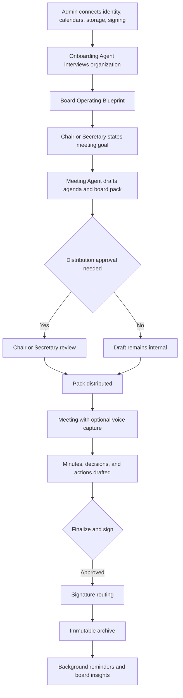
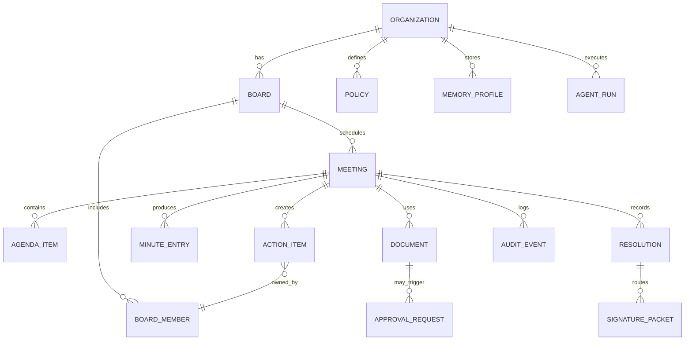
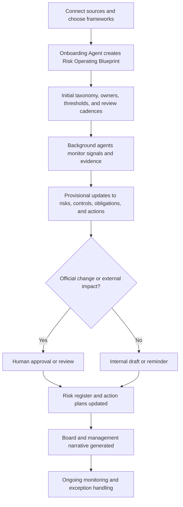
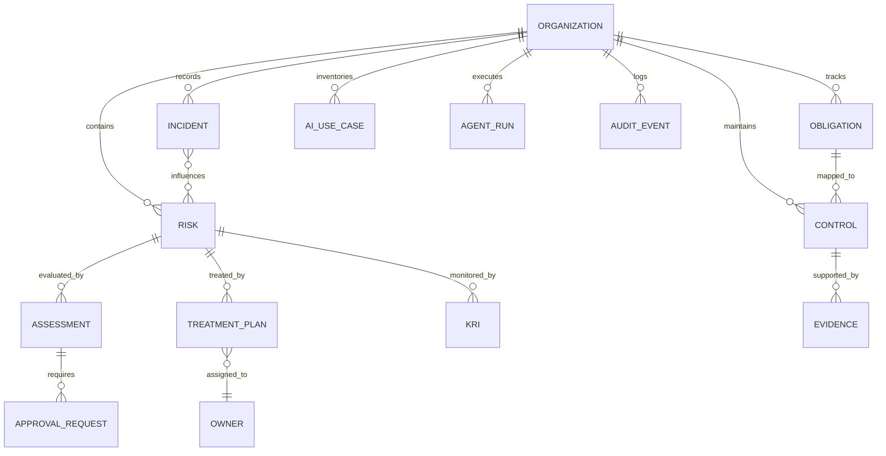

# AI Agent SaaS PRDs for Styreportal and RISK

## Executive summary

By April 2026, the center of gravity in enterprise SaaS has shifted from “AI copilots bolted onto existing screens” to workflow-native agents that can search, reason, draft, execute, monitor, and collaborate inside the system where work already happens. The clearest product signals come from Asana’s AI Teammates and AI Studio, Notion’s Custom Agents, Slackbot’s context-aware personal agent, Atlassian Rovo’s action-oriented agents, Microsoft Copilot Studio’s autonomous background agents, ServiceNow’s AI Agent Orchestrator, Google Cloud’s Vertex AI Agent Builder, and Workday’s Agent System of Record. Across those products, the agent is no longer just a chat box; it is becoming an operating layer wrapped around context, tools, approvals, and outcomes. citeturn0search1turn11search0turn11search2turn20search6turn3search15turn2search2turn19search3turn2search0turn13search3

The strongest evidence from both product practice and engineering guidance is that the best agentic SaaS experience is collaborative rather than fully autonomous. Anthropic’s guidance argues that simple, composable agent patterns outperform unnecessarily complex frameworks in production. Microsoft’s autonomous-agent guidance centers triggers, instructions, and guardrails; OpenAI’s agent guidance centers tools, state, orchestration, guardrails, tracing, and human review; Microsoft Research’s Magentic-UI explicitly argues for co-planning, action guards, and low-cost human involvement in agentic systems. In other words, the optimal 2026 workflow is not “AI does everything”; it is “AI handles the flow of work while humans retain authority at the points that matter.” citeturn1search1turn19search4turn19search5turn15search20turn18search0turn18search4

That matters especially for the two products in scope. For **Styreportal**, the AI-native design target should be a calm board operating system that helps a chair, secretary, CEO, and directors prepare, run, close, sign, archive, and follow up on board work without forcing them through brittle dashboard navigation. Existing board platforms already use AI for summarization, minute drafting, action tracking, and faster meeting preparation; the next step is to make those capabilities part of an end-to-end operating flow with explicit approval gates and auditable evidence trails. citeturn14search0turn14search8turn14search16

For **RISK**, the design target should be a live risk operating system rather than a static register. Existing GRC and risk platforms are increasingly positioning themselves around dynamic automation, AI-assisted gap detection, AI governance, continuous monitoring, and evidence-led workflows. The opportunity is to turn those fragments into a governed, collaborative layer where agents ingest signals, update draft assessments, map obligations to evidence, prepare review packs, and orchestrate remediation while people remain accountable for scoring, acceptance, disclosure, and closure. citeturn14search5turn14search6turn14search10turn14search11turn14search15

The technical implication is equally clear: both products should share a common platform spine built around a policy engine, approval system, memory service, evidence graph, multilingual interaction layer, integration hub, audit ledger, and evaluation stack. Open standards such as MCP are becoming important for tool interoperability, and major vendors now expose agent runtimes, registries, connectors, and observability as first-class capabilities. At the same time, those same tool-connected systems raise prompt-injection, over-permissioning, and memory-leakage risks, so governance cannot be an afterthought. citeturn10search2turn10search4turn10search9turn15search9turn15search12turn15search1turn17search4

The compliance baseline for these PRDs is high by design. Norway is bound by GDPR through the EEA; Datatilsynet explicitly notes that cloud providers acting on behalf of an organization are data processors; and the European Commission’s GDPR principles still require purpose limitation, minimization, storage limitation, integrity, confidentiality, and transparency. For electronic signatures, eIDAS gives qualified signatures the same legal effect as handwritten signatures across Europe, and BankID positions its signing service as meeting the EU’s strict trust-service requirements. For risk customers in regulated finance, DORA entered into force in Norway on July 1, 2025. citeturn6search2turn6search14turn6search0turn6search9turn16search2turn16search13turn7search2turn7search10

The recommendation, therefore, is not to build “AI features.” It is to build **two complete governed operating systems from day one**: one for board work and one for risk work. Both should feel natural, trustworthy, and inviting through quiet automation, artifact-first collaboration, reversible actions, visible plans, role-aware adaptation, explicit approvals, and evidence-backed outputs. That is the shape of modern agentic SaaS in 2026. citeturn20search6turn23search2turn11search8turn2search5turn18search0turn14search16

## State of agentic SaaS

The current state of agentic SaaS in 2026 is not “single super-agent replaces SaaS.” It is “SaaS becomes more intelligent, personalized, adaptive, and autonomous while remaining grounded in domain workflows, permissions, and data models.” Deloitte describes SaaS as evolving toward a federation of real-time workflow services, while Bain and McKinsey both frame the shift as a redesign of workflows, governance, data, and operating models rather than a simple UI upgrade. Official product roadmaps from Google, Microsoft, Salesforce, ServiceNow, Atlassian, Notion, Asana, and Workday all point in the same direction. citeturn13search1turn13search2turn13search6turn13search12turn23news47turn2search2turn3search8turn19search3turn3search7turn3search2turn0search1turn13search3

Three UX conventions now appear repeatedly across leading products. First, the agent is embedded where work already lives, not hidden in a separate tool; Slack emphasizes that Slackbot works inside Slack and uses only the information a user can already access, while Asana emphasizes AI embedded in existing workflows instead of requiring users to seek out a separate AI application. Second, background automation has become a default pattern; Notion’s Custom Agents run on triggers and schedules, and Microsoft’s autonomous agents continuously watch for events and execute flows in the background. Third, users increasingly configure workflows in natural language; Asana’s “words to workflows” creates triggers, conditions, and actions from plain English, and ServiceNow and Microsoft both expose natural-language or low-code agent builders. citeturn20search6turn23search2turn11search8turn11search2turn20search3turn15search20turn11search4turn19search3turn2search10

A fourth convention is quietly becoming just as important: **governance is now productized**. Workday’s Agent System of Record treats agents as lifecycle-managed workers. Google’s agent stack now includes runtime, identity, gateway, registry, evaluation, observability, and simulation. OpenAI’s agent stack exposes tracing, handoffs, guardrails, MCP/connectors, and evaluation. Microsoft provides multistage approvals and analytics for autonomous runs. This is a strong signal that the best modern SaaS UX is not “one magical model”; it is a combination of agent runtime, policy, observability, and human review. citeturn13search11turn23news47turn15search19turn15search1turn5search2turn15search12turn5search0turn19search0turn15search9turn15search5turn5search3

### Leading examples and what they do well

| Product | What it does well | Why it matters for these PRDs | Sources |
|---|---|---|---|
| Slackbot | Makes the agent the front door to work, grounded in the user’s existing permissions, messages, files, channels, and tools; emphasizes “nothing to install” and “nothing new to manage.” | The best AI workflow feels native and low-friction. Agents should discover the right path rather than asking users to know which subsystem to open. | citeturn20search6turn23search2turn11search3 |
| Notion Custom Agents | Turns agents into persistent team resources that run on schedules and triggers across docs, databases, mail, calendar, Slack, and more; adds skills and autofill directly into databases. | Agentic SaaS should operationalize repeated work in the background, not only respond to one-off chat prompts. | citeturn11search2turn20search3turn3search14 |
| Asana AI Teammates and AI Studio | Gives agents team context, checkpoints, and workflow-native execution; lets people generate workflows from natural language. | Users should express goals, not build logic trees by hand; agents should reveal interim checkpoints rather than act invisibly. | citeturn0search1turn11search0turn11search4 |
| Atlassian Rovo | Unifies search, chat, editing, automation rules, and specialized agents, with growing multi-agent orchestration. | The best products merge retrieval, action, and collaboration rather than treating them as separate features. | citeturn3search15turn11search9turn19search2turn19search14 |
| Microsoft Copilot Studio | Treats autonomous agents as event-driven background workers with guardrails, approvals, and analytics. | Background execution must be visible, governable, and measurable. | citeturn2search2turn15search5turn5search3turn15search14 |
| ServiceNow AI Agents | Uses an orchestrator to coordinate teams of specialists and offers a natural-language studio to build them. | Complex enterprise workflows need orchestrator-plus-specialist patterns, not one generalist agent. | citeturn19search3turn19search15 |
| Workday Agent System of Record | Adds lifecycle management for agents across registration, configuration, activation, deactivation, and governance. | Agents should be treated like managed operational entities with ownership, policy, and lifecycle—not just hidden code paths. | citeturn13search3turn13search11 |
| Diligent Boards AI | Applies AI directly to board materials, minutes, action items, and secure board prep. | In governance-focused products, the value is not novelty; it is trusted time-saving on high-friction administrative work. | citeturn14search0turn14search16 |
| OneTrust, LogicGate, Resolver | Emphasize AI governance inventories, dynamic automation, evidence, control mapping, and gap detection across risk workflows. | Risk products win when they continuously connect signals, obligations, evidence, and action. | citeturn14search5turn14search6turn14search10turn14search11turn14search15 |

### Common failure modes

| Failure mode | Why it happens | What the evidence suggests | Design response |
|---|---|---|---|
| Chatbot skin over unchanged software | Vendors add a chat tab without deep task execution or artifact integration. | Asana, Slack, and Notion all emphasize AI embedded where work already happens, rather than a disconnected assistant. | Put the agent in the workflow shell itself: inbox, editor, meeting pack, risk register, approvals. |
| Over-automation without visible checkpoints | Agents silently act across tools and surprise users. | Magentic-UI argues for co-planning, action guards, and approval for sensitive operations; Microsoft emphasizes approvals and analytics. | Show the plan first, show the evidence, and interrupt only when stakes justify it. citeturn18search0turn18search4turn15search5turn5search3 |
| Needlessly complex multi-agent systems | Teams assume “more agents = better system.” | Anthropic’s production guidance says the most successful implementations use simple, composable patterns rather than complex frameworks. | Start with the smallest orchestrator-specialist structure that maps to real domain boundaries. citeturn1search1 |
| Context bloat and stale memory | Long-running agents accumulate too much irrelevant state and degrade over time. | Anthropic describes context as finite and argues that context engineering is now central to effective agents. | Use layered memory, compaction, and evidence-linked retrieval rather than dumping full history into every run. citeturn17search3turn12search13 |
| Unsafe tool use and prompt injection | Tool-connected agents treat untrusted content as trusted instructions. | OpenAI explicitly warns that prompt injection is especially important when models access MCP servers and connectors; computer use guidance says to treat page content as untrusted input. | Isolate tools, scope credentials, insert guardrails before and after tool calls, and require review for high-impact actions. citeturn15search3turn15search9turn12search0 |
| Memory privacy leakage | Persistent memory stores private user data without sufficient safeguards. | Recent ACL work shows long-term agent memory creates real extraction risks and needs safeguards. | Make persistent memory selective, consented, redactable, and policy-governed. citeturn17search4turn17search0 |
| Fragile browser automation | Agents interact with UIs instead of stable APIs, causing brittleness and safety risk. | OpenAI recommends isolated browser or VM execution and human-in-the-loop review for high-impact actions. | Prefer APIs and event integrations first; use browser automation only as a bounded fallback. citeturn12search0 |
| No evaluation or traceability | Teams cannot see why an agent failed or whether changes improved reliability. | OpenAI, Google, and Microsoft all now expose trace, eval, and analytics surfaces for agent systems. | Build evaluation and observability into the core product from day one. citeturn5search0turn5search2turn5search3turn15search12 |

## Cross-product design framework

The best 2026 user workflow has a recognizable shape across both products. A new customer connects data, establishes roles and policies, states goals in natural language, reviews a system-generated operating blueprint, and moves into daily use where background agents continuously prepare work, surface exceptions, and ask for approval only when the action changes official records, affects external parties, or crosses risk boundaries. This “plan, preview, confirm, execute, monitor, learn” loop mirrors the most mature product patterns now visible in deep research tools, workflow builders, autonomous agents, and human-centered agent interfaces. citeturn2search5turn11search4turn15search20turn18search0

The core UX principle is that **AI should feel like a collaborative operating layer, not an intrusive co-worker**. That means a persistent intent bar, artifact previews, an approval inbox, subtle background-job status, evidence drawers, and role-specific home surfaces. It also means the system should reveal its reasoning in product terms: “I drafted this agenda from unresolved action items, last meeting minutes, and this quarter’s finance pack,” or “I increased this risk’s provisional score because three fresh signals crossed the threshold.” Users should not need to infer where the AI got its answer. They should see the provenance one click away. This is consistent with the trust literature, with human-agent-system arguments in recent research, and with product practice emphasizing permissions, checkpoints, and data boundaries. citeturn18search1turn18search3turn20search6turn0search1turn14search16

### Recommended workflow pattern

A best-in-class agentic SaaS loop should work like this:

1. **Guided onboarding.** The product interviews the user about goals, cadence, approvals, compliance posture, and integrations.
2. **Operating blueprint generation.** The system drafts a human-readable configuration and workflow map.
3. **Artifact-first execution.** The primary output is not a chat reply; it is a draft agenda, board pack, risk register change, report, task list, or approval queue.
4. **Risk-tiered autonomy.** Low-risk actions execute automatically; medium- and high-risk actions prompt for approval.
5. **Background monitoring.** Agents continue to watch systems, deadlines, and changes between active sessions.
6. **Exception-driven interaction.** Users mostly review highlighted deltas, exceptions, or ready-to-approve artifacts.
7. **Learning loop.** The product updates preferences, templates, and routing rules selectively and transparently.

This is the most practical balance between speed and control in 2026. citeturn11search2turn15search20turn5search3turn13search11turn17search3

### Agent architecture alternatives

| Architecture option | Strengths | Main risks | Recommended use |
|---|---|---|---|
| Single generalist agent | Fastest to prototype; simple mental model; fewer coordination bugs. | Domain leakage, prompt bloat, weak reliability on long or complex flows. | Useful only for narrow, bounded tasks. |
| Orchestrator plus specialists | Clear domain boundaries; easier testing; better tool scoping; stronger explainability. | More routing complexity; can over-fragment if pushed too far. | Best default for high-value SaaS workflows. |
| Event-driven background agents plus conversational supervisor | Strong for ongoing monitoring, asynchronous work, and exception handling. | Requires mature policy, audit, and state management. | Best for production SaaS with recurring workflows. |
| Large multi-agent mesh | Potential parallelism and specialization. | Operational sprawl, hidden failures, contextual inconsistency, cost growth. | Avoid as a primary design unless a simpler orchestrator fails. |

**Recommendation:** build a hybrid of the second and third patterns: one visible conversational supervisor plus a small set of role-specific background agents. That aligns with Anthropic’s “simple composable patterns,” OpenAI’s handoffs/tools model, Atlassian’s multi-agent direction, and ServiceNow’s orchestrator approach. citeturn1search1turn19search0turn19search1turn19search2turn19search3turn19search15

### Memory strategy alternatives

| Memory strategy | Benefit | Risk | Recommendation |
|---|---|---|---|
| Session-only memory | Minimal privacy footprint and easy behavior. | No personalization, no continuity, repeated setup burden. | Insufficient for serious SaaS workflows. |
| Full transcript persistence | High recall. | Privacy exposure, context bloat, stale retrieval, poor steerability. | Avoid as the main strategy. |
| Summary-only memory | Lower token load and better continuity than raw transcripts. | Can flatten nuance and lose provenance. | Useful, but not enough on its own. |
| Layered memory | Separates session state, task state, org memory, evidence graph, and consented personal preferences. | More design work and governance complexity. | Best production pattern. |

**Recommendation:** use layered memory with four classes: transient session memory, task/working memory, organizational operating memory, and opt-in personal preference memory. Pair this with evidence-linked retrieval, compaction, retention controls, and deletion tooling. That recommendation follows Anthropic’s context-engineering guidance, recent reflective-memory work, and recent privacy-risk findings on agent memory. citeturn17search3turn10search14turn17search9turn17search2turn17search4

### Permission models

| Permission model | Benefit | Weakness | Recommendation |
|---|---|---|---|
| Role-based access only | Familiar enterprise model. | Too coarse for autonomous actions. | Keep as baseline, not as sufficient control. |
| Just-in-time confirmation for every tool action | High control. | Interruption overload; destroys flow. | Use only for high-risk actions. |
| Policy-driven risk tiers over RBAC and attributes | Balances autonomy and control; supports context-aware approvals; scales to multiple agents. | Requires upfront policy system. | Best long-term model. |

**Recommendation:** implement **RBAC + attribute rules + risk-tiered approval policy**. Let agents execute read/search/summarize actions automatically; require confirmation for external communications, canonical record changes, and signature initiation; require dual approval for destructive, legal, regulator-facing, or financially sensitive actions. This is aligned with OpenAI’s approval-capable connector model, Microsoft’s multistage approvals, Slack’s permission-first posture, and Google’s tool-governance direction. citeturn10search0turn15search9turn15search5turn20search6turn15search1

### Multimodal and adaptive UX guidance

Voice and multimodal interaction are now technically mature enough to be useful, but they should be applied selectively. OpenAI and Google both now support low-latency real-time multimodal voice interactions, and Microsoft supports voice-enabled agents and IVR flows. In practice, the right rule for governance-heavy SaaS is simple: use voice for **capture, review, and hands-free interaction**, but keep the system of record in text, structured fields, and evidence-linked artifacts. For board meetings and risk reviews, the safest pattern is usually a chained pipeline that produces clear transcripts and structured outputs rather than relying only on opaque end-to-end speech interactions. citeturn4search0turn4search4turn4search8turn4search2turn4search3turn4search7

Adaptive UX should be role- and maturity-aware, not creepy. Slackbot’s role-aware workflows and Notion’s reusable skills show the right direction: the system should adapt to the user’s role, preferred artifact style, and successful habits, while staying within clear permission boundaries and allowing memory to be reviewed and reset. That means novice users see guided explanations and simple approvals; expert users see bulk tools, keyboard-driven reviews, and denser evidence views. citeturn23search2turn3search14turn17search2

## Styreportal PRD

### Product definition

**Product overview.** Styreportal is a cloud-based board management operating system for Norwegian organizations. From day one, the product includes secure board workspaces, meeting scheduling and invitation flows, agenda and board-pack generation, annotated document review, guided minute drafting, action tracking, e-signature routing, archival search, approvals, and an AI operating layer that coordinates preparation, execution, follow-up, and governance insights. This is deliberately broader than a board portal or document repository: the system is designed to replace fragmented email-and-attachment workflows with one governed operating environment. Existing market leaders already demonstrate that board-management AI is most valuable when it saves time on meeting prep, minute drafting, action-item follow-up, and secure governance workflows. citeturn14search0turn14search8turn14search16

**Open-ended assumptions.** Exact tenant scale, user counts, hosting footprint, and integration depth are unspecified and treated as configurable. The product must support Norwegian-language operation end to end, with English as a first-class parallel language. It should serve private companies, nonprofits, foundations, associations, public-adjacent entities, and regulated organizations without assuming one universal governance template.

**Target users and personas.**

| Persona | Goals | Friction today | Day-one value |
|---|---|---|---|
| Board chair | Focus meetings on the right issues, make better decisions, close actions. | Chase updates, curate agendas manually, inconsistent follow-through. | AI-curated agenda suggestions, decision tracking, concise pre-reads. |
| Board secretary / executive assistant | Prepare board packs, coordinate attendees, draft minutes, route signatures, archive records. | Email chaos, version control, repetitive admin, deadline risk. | Pack builder, minute drafts, signature routing, archive automation. |
| Board member | Review materials quickly, understand deltas, annotate, sign, stay accountable. | Large packs, little prioritization, weak continuity across meetings. | Personalized briefings, delta views, secure annotations, reminder flows. |
| CEO / management contributor | Submit papers, understand what the board needs, track follow-up. | Ambiguous requests, missed deadlines, inconsistent feedback loops. | Guided submission templates, required-appendix checks, assigned actions. |
| Legal / compliance | Ensure evidence, traceability, retention, and signature assurance. | Weak audit trail and scattered documentation. | Immutable audit trail, retention controls, signature provenance. |

**Value proposition.** Styreportal wins when it gives every participant a calmer version of board work. The chair gains clarity. The secretary gains leverage. Directors gain digestibility. Management gains structure. Legal and compliance gain defensible records. The AI should therefore optimize for three product outcomes above all else: **less admin friction, better decision readiness, and stronger evidence quality**.

### Experience and workflow

Styreportal’s daily experience should revolve around seven surfaces: a role-aware **Board Home**, a universal **Ask Styreportal** intent bar, a **Meeting Studio**, a **Decision and Action Center**, a **Signature Center**, a **Secure Archive**, and an **Approval Inbox**. The home screen should not resemble a legacy dashboard full of tiles. It should feel like a board operating layer: next meeting status, missing inputs, unresolved actions, requested approvals, recent decisions, and one or two calm AI suggestions. That design follows the strongest modern agentic pattern: embedded, context-aware, low-friction workflow guidance instead of a flashy standalone assistant. citeturn20search6turn11search8turn11search2

The onboarding flow should begin with connection and intent, not deep configuration menus. After the organization admin connects identity, calendars, document storage, and e-sign providers, the onboarding agent should ask a short operational interview: meeting cadence, approval authority, agenda style, confidential document classes, minute-signoff rules, signature requirements, preferred language, and retention expectations. The output should be a **Board Operating Blueprint** the user can review in plain English or Norwegian before activating it. This mirrors the best plan-first pattern now found in deep research tools, natural-language workflow builders, and human-in-the-loop agent systems. citeturn2search5turn11search4turn18search0

A first-use goal-expression example should feel like this:

```text
User: We have 7 board members, meet quarterly, want packs finalized 5 days before the meeting,
use BankID for signatures, and need all final board records archived with clear audit trails.
Please set up our board workflow.
```

```text
Agent: I created a draft Board Operating Blueprint.
- Meeting cadence: quarterly
- Pack deadline: T-5 days
- Default meeting workflow: chair draft -> secretary finalize -> distribution approval
- Signature provider: BankID-compatible flow
- Final record classes: invite, agenda, pack, minutes, resolutions, signatures, action log
Would you like me to activate this workflow, create the first meeting template, and send setup tasks
to the board secretary?
```

Once active, the daily operating loop should feel substantially more natural than legacy portals. A chair or secretary should be able to say:

```text
User: Prepare the June board meeting using open actions, last meeting minutes,
the Q2 finance materials, and any unresolved compliance issues.
Propose a prioritized agenda and identify missing appendices.
```

The agent should autonomously gather materials, generate a proposed agenda, draft a pack, and flag missing items, but it should hold distribution until a human approves. It should also explain itself in concrete product terms: “I prioritized compliance because two open actions are overdue and the finance pack contains one variance above threshold.” This is how the system stays helpful without becoming intrusive.

A confirmation dialog for the distribution step should be explicit and calm:

```text
Ready to distribute board pack?
Meeting: June Board Meeting
Recipients: 7 directors, 1 observer
Included: agenda, 5 appendices, prior-action summary, draft resolution log
Missing: signed management letter
Approvals required: Chair or Secretary
[Review pack] [Request missing item] [Approve and distribute]
```

During the meeting, Styreportal should offer an optional voice-assisted mode for live note capture, but never make voice mandatory. The meeting secretary can start secure capture, the system produces a transcript and suggested minute blocks, and visible live cards show candidate decisions and action items as they are detected. The secretary confirms, edits, or dismisses them in the moment. This keeps voice useful but auditable. citeturn4search0turn4search8turn4search3

After the meeting, the AI should draft minutes, build a resolution list, assign owners and deadlines, and prepare signature flows. Final minutes, resolutions, and external distribution should always require human approval. The archive should then become automatic: final versions, signature proofs, timestamps, approvals, and action histories should be stored as a linked evidence record rather than a pile of disconnected files.



### Intelligence and autonomy requirements

Styreportal should use a small specialist-agent architecture under one visible supervisor. The recommended specialist set is:

| Agent | Purpose | Default autonomy |
|---|---|---|
| Onboarding Agent | Interviews the organization and creates the Board Operating Blueprint. | Autonomous draft generation |
| Meeting Agent | Proposes agendas, assembles board packs, prioritizes papers, flags missing items. | Autonomous draft generation |
| Minutes Agent | Drafts minute blocks from transcript, notes, and agenda flow. | Autonomous draft generation |
| Resolution Agent | Extracts resolutions, approval needs, and decision statuses. | Suggestive only until confirmed |
| Action Agent | Tracks owners, deadlines, reminders, and closure evidence. | Autonomous reminders; approval for reassignments |
| Signature Agent | Builds signing packets and tracks completion. | Requires approval before send |
| Archive Agent | Classifies and links final records, audit proofs, and retention labels. | Autonomous after finalize |
| Governance Insights Agent | Produces board briefings, trend summaries, and follow-up heatmaps. | Autonomous summaries |

This structure intentionally follows the “simple composable patterns” advice from Anthropic and the orchestrator-plus-specialists approach that now appears across OpenAI, Atlassian, and ServiceNow documentation. citeturn1search1turn19search0turn19search2turn19search3

A practical autonomy policy for Styreportal should be:

| Action class | Policy |
|---|---|
| Search, summarize, highlight deltas, classify documents | Autonomous |
| Draft agendas, packs, minutes, and action lists | Autonomous into draft state |
| Update non-final draft metadata | Autonomous with audit log |
| Distribute packs, send board communications, initiate signatures | Explicit approval required |
| Finalize minutes, lock archive record, delete records, export outside tenant | Dual approval or designated approver required |
| Any low-confidence extraction or conflicting evidence | Stop, explain uncertainty, request review |

The memory model should be layered and evidence-linked:

| Memory layer | Contents | Retention posture |
|---|---|---|
| Session memory | Current prompt chain and active screen state | Ephemeral |
| Working memory | Current meeting cycle, unresolved actions, draft artifacts, pending approvals | Until cycle closes |
| Organizational memory | Meeting cadence, style preferences, signature policy, role routing, templates | Persistent, admin-governed |
| Personal preference memory | Reading style, language, reminder style, notification timing | Opt-in, user-visible |
| Evidence graph | Documents, annotations, decisions, signatures, timestamps, audit events | Policy-governed record retention |

This design captures the benefits of persistent personalization without creating uncontrolled memory risk. It also makes deletion and DSAR handling tractable. citeturn17search3turn17search9turn17search4

A representative system message for the meeting agent should be concise and operational:

```text
You are the Styreportal Meeting Agent.
Your job is to help boards prepare and execute meetings accurately, calmly, and securely.
Always prefer evidence-backed suggestions over speculation.
Never distribute materials, finalize minutes, initiate signatures, or alter final records without required approval.
When uncertain, show the evidence you used and ask for clarification.
Optimize for confidentiality, traceability, and concise board-ready output.
```

### Tool integrations, permissions, and data model

Day-one integrations should be category-based and product-wide rather than point-solution-specific: SSO and provisioning, calendar and email, document repositories, video meeting systems, e-signature providers, enterprise storage, optional BI/ERP sources for factual appendices, and optional public-sector-compatible identity/signing flows. For Norwegian organizations, support for BankID-compatible signing and, where relevant, public identity patterns such as ID-porten-related flows should be part of the integration strategy rather than an afterthought. Digdir documents that ID-porten supports familiar eIDs such as BankID, Buypass, and Commfides for public services, while BankID positions itself as Norway’s widely used secure authentication and signing layer. citeturn16search12turn16search11turn16search9

Permissions should respect both human roles and agent scopes. Human roles include board chair, secretary, director, management contributor, observer, auditor, and workspace admin. Agent scopes should be even narrower: read-documents, summarize, create-drafts, send-for-approval, request-signature, archive-record, and export-report. No agent should ever inherit broad “admin” privileges.

The core data model should be explicit, typed, and auditable.



The key entities are straightforward: Organization, Board, Board Member, Meeting, Agenda Item, Document, Minute Entry, Resolution, Signature Packet, Action Item, Approval Request, Policy, Memory Profile, Agent Run, and Audit Event. Every auto-generated artifact should carry provenance fields showing source inputs, generating agent, confidence, approval state, and last human editor.

### Compliance, safety, operations, and metrics

Styreportal should assume that GDPR requirements apply in Norway and that the product must support controller-processor discipline, minimization, transparency, and secure handling of personal data and board documents. Datatilsynet explicitly notes that cloud providers processing personal data on behalf of an organization are data processors, which makes vendor management, DPA terms, subprocessor transparency, and auditability part of the product requirement set. citeturn6search2turn6search14turn6search0

For signatures, the system should support configurable assurance levels. The European Commission states that a qualified electronic signature has the same legal value as a handwritten signature across Europe, and BankID states that its signing solution meets the EU’s strict trust-service requirements and is legally valid across Europe. The safest product design is therefore to support policy-based signature routing by document class: basic approval, advanced e-signature, or qualified/equivalent signing flow as required by customer policy. citeturn6search9turn16search2turn16search13

The safety stack should include prompt-injection filtering for imported content, scoped tool permissions, explicit approval policy, immutable audit logging, reversible draft states, secrets isolation, export controls, and anomaly alerts for unusual agent behavior. Imported PDFs, emails, and notes should be treated as untrusted inputs. OpenAI’s guidance on MCP, connectors, and computer use makes this especially important for any agent that can act across tools or interfaces. citeturn15search3turn15search9turn12search0

Operationally, Styreportal needs a clear runbook from day one.

| Trigger | Automatic response | Human owner | Required artifact |
|---|---|---|---|
| Wrong or low-confidence minute draft | Freeze finalization; highlight uncertain sections; request review | Secretary | Redlined draft + evidence links |
| Suspected prompt injection from uploaded material | Block downstream write actions; quarantine source item | Security admin | Incident log + source trace |
| Stalled signature flow | Send reminder sequence; surface bottleneck in Signature Center | Secretary | Signature status report |
| Missing appendix near pack deadline | Create task and notify responsible contributor | Secretary / contributor owner | Missing-item card |
| Unusual agent action pattern | Revoke agent action scope pending review | Workspace admin | Audit trace |
| DSAR or deletion request for memory | Export visible memory; process deletion/redaction workflow | Privacy admin | DSAR bundle |

Monitoring and evaluation should combine agent-quality metrics with product outcomes. OpenAI, Google, and Microsoft all now provide strong evidence that traces, evaluations, and analytics are first-class production requirements for agents. citeturn5search0turn5search2turn5search3turn15search12

**Agent-quality metrics**
- Agenda relevance acceptance rate
- Pack completeness precision and recall
- Minute draft edit distance before approval
- Decision extraction precision
- Action assignment correction rate
- Signature-routing success rate
- Norwegian language parity across summarization and transcription
- Approval interruption rate
- Evidence citation coverage for generated outputs

**Product outcome metrics**
- Time to assemble board pack
- Time from meeting end to approved minutes
- Time from approval to completed signatures
- Action-item closure latency
- Board member pre-read completion rate
- Search success rate in archive
- Reduction in email attachments and off-platform coordination
- Admin hours saved per meeting cycle

**Continuous improvement agenda**
- Better multilingual transcription and diarization for Norwegian meetings
- Smarter agenda ranking based on historical decision outcomes
- Personalized director briefings with transparent memory controls
- Tighter integration with risk and compliance data for board packs
- Stronger archival policy templates by entity type and sector

## RISK PRD

### Product definition

**Product overview.** RISK is a cloud-based AI-native risk management operating system for Norwegian organizations. From day one, the full product includes risk taxonomy setup, risk and control registers, evidence linkage, assessments, treatment plans, owner workflows, obligation mapping, KRI tracking, incident capture, board and management reporting, AI governance inventory, and an agent layer that continually monitors signals, drafts updates, prepares review materials, and coordinates remediation. This is a deliberate move beyond the traditional GRC dashboard model. Today’s leading platforms already emphasize dynamic automation, AI governance, continuous monitoring, and evidence-backed workflows; the opportunity is to unify those capabilities into one collaborative operating layer. citeturn14search5turn14search6turn14search10turn14search11turn14search15

**Open-ended assumptions.** Industry, geography, scale, and integration scope are configurable. The day-one system must work for general enterprise risk as well as cyber, operational, compliance, third-party, and AI-related risk. It must support Norwegian and English user experiences equally.

**Target users and personas.**

| Persona | Goals | Friction today | Day-one value |
|---|---|---|---|
| Risk lead / CRO | Maintain a living risk view and run review cycles efficiently. | Static spreadsheets, fragmented evidence, slow updates. | Dynamic draft updates, review queues, board-ready narratives. |
| Compliance officer | Tie obligations to controls, evidence, and attestations. | Manual mapping, audit scramble, stale evidence. | Obligation-to-evidence graph, freshness tracking, reminders. |
| CISO / security manager | Merge cyber signals with business risk language. | Security tools disconnected from enterprise risk reporting. | Signal ingestion, provisional risk suggestions, control-health views. |
| Business owner | Understand their risks and actions without living in a GRC tool. | Burdensome forms, abstract scoring, unclear priorities. | Simple attestation flows, guided action plans, contextual explanations. |
| Internal audit | Verify process and evidence quickly. | Evidence in too many places, poor traceability. | Immutable histories, review exports, audit-ready packets. |
| Executive / board reader | See material changes and decision needs fast. | Dense heatmaps without narrative or action clarity. | Narrative-first summaries linked to evidence and owner actions. |

**Value proposition.** RISK should reduce the time between signal and action. It should turn scattered risk data into one living system that can identify change, prepare the next human decision, and document why that decision was made.

### Experience and workflow

The onboarding experience should start with frameworks, appetite, and sources. The system asks which frameworks to align to, which signal sources to connect, who owns which domains, what appetite thresholds exist, and what cadence applies for reviews and attestations. For Norwegian use cases, ISO 31000, NIST CSF, NSM’s ICT security principles, and—where relevant—DORA should be available as selectable overlays rather than separate product modules. ISO 31000 provides the general risk-management structure; NIST CSF 2.0 and NSM provide strong cyber and security references; and DORA is already in force in Norway for relevant financial firms. citeturn7search3turn7search11turn6search3turn6search11turn7search8turn7search12turn7search2turn7search10

A first-use goal-expression example should look like this:

```text
User: We are a Norwegian company with 250 employees.
Use ISO 31000 as the base framework, map cyber risks to NIST CSF and NSM principles,
run monthly owner attestations, and escalate any critical third-party or operational risk
to the CFO and board pack.
```

```text
Agent: I created a draft Risk Operating Blueprint.
- Framework overlays: ISO 31000, NIST CSF, NSM ICT principles
- Review cadence: monthly attestations, quarterly board reporting
- Escalation rule: critical operational or third-party risks -> CFO + board review
- Connected signals requested: ticketing, incident management, vulnerability feed, vendor register, policy repository
Would you like me to generate the first risk taxonomy, ownership map, and attestation schedule?
```

The day-to-day user experience should center on a **Risk Home**, **Ask RISK** intent bar, **Evidence Drawer**, **Assessment Workspace**, **Obligations Hub**, **Approval Inbox**, and **Board View**. The home screen should lead with narrative deltas: “Three risks changed materially this week,” “One key control has stale evidence,” “Two treatment plans are blocked,” and “One AI use case needs review.” Heatmaps should still exist, but they should support the narrative rather than dominate it.

Daily operation should feel like this. Background agents ingest signals from ticketing, incidents, change logs, vulnerability tools, policy repositories, and owner attestations. They create provisional updates: a suggested risk-score change, a new linked control gap, a stale-evidence warning, or a draft treatment plan. The human then reviews only the exceptions that matter.

```text
User: Summarize the material changes in operational and cyber risk since last month,
draft updates for the register, and prepare a board-ready summary.
```

```text
Agent: I found 4 material changes.
1. Vendor concentration risk increased because the new supplier contract is single-source.
2. Cyber access-control risk increased because three high-severity vulnerabilities remain open.
3. The business continuity control for payroll now has fresh tested evidence and can be downgraded.
4. Two AI use cases were added without completed assessments.
I prepared draft register updates and a 1-page board narrative.
Review risk-score changes before I publish them.
```

A confirmation dialog should separate analysis from official record mutation:

```text
Publish risk register updates?
Items affected: 4
High impact: 2
Source evidence linked: yes
Owner notifications queued: 5
Board narrative updated: yes
[Review evidence] [Publish changes] [Send for review instead]
```

Voice should be supported mainly for walkthroughs, site observations, and meeting capture. A risk manager on site can record a short voice note, attach a photo or document, and let the system draft an observation. In a review meeting, voice capture can turn discussion into candidate updates and action items—but official risk changes still require a human approver. This follows the same “voice for capture, text for record” pattern recommended for board workflows. citeturn4search0turn4search8turn4search2



### Intelligence and autonomy requirements

RISK should use a domain-specialist multi-agent architecture, again under one visible supervisor.

| Agent | Purpose | Default autonomy |
|---|---|---|
| Onboarding Agent | Builds the Risk Operating Blueprint from frameworks, sources, appetite, and ownership. | Autonomous draft generation |
| Signal Agent | Ingests events, alerts, issues, tickets, incidents, and owner attestations. | Autonomous |
| Assessment Agent | Drafts new or changed risk assessments and score proposals. | Draft-only for official register changes |
| Control and Evidence Agent | Maps evidence to controls, flags stale proof, prompts for attestations. | Autonomous reminders and evidence linking |
| Obligations Agent | Maps regulations, policies, and internal rules to controls and evidence. | Autonomous draft mapping |
| Treatment Agent | Proposes treatment plans, dependencies, and remediation routing. | Autonomous drafts; approval for owner reassignment or external notifications |
| Board Reporting Agent | Produces narrative summaries and board-ready deltas. | Autonomous draft generation |
| AI Governance Agent | Maintains inventory and assessment workflows for AI use cases and agents. | Draft-only for official registration or policy change |

This structure matches the specialist-agent approach now visible in ServiceNow orchestrators, OpenAI handoffs, Google agent platforms, and portfolio-scale agent management patterns. citeturn19search3turn19search15turn19search0turn23news47turn13search11

The autonomy policy should be strict where accountability matters most:

| Action class | Policy |
|---|---|
| Summarize signals, classify evidence, draft assessments, prepare reports | Autonomous |
| Compute provisional KRI movement and freshness warnings | Autonomous |
| Change an official risk score, create a new canonical register entry, or downgrade a control officially | Approval required |
| Notify regulators, close incidents, alter policy obligations, or accept risk beyond threshold | Dual approval / designated approver |
| Detect conflicting evidence or low-confidence mapping | Stop and request review |

The memory model should closely mirror Styreportal’s, but with stronger time-series and framework-awareness:

| Memory layer | Contents |
|---|---|
| Session memory | Current review or analysis context |
| Working memory | Active review cycle, pending assessments, current board/reporting window |
| Organizational memory | Taxonomy, appetite thresholds, framework overlays, owner map, escalation rules |
| Personal preference memory | Preferred report style, notification timing, evidence view preferences |
| Evidence graph | Risks, controls, incidents, obligations, assets, owners, actions, attestations, AI use cases |
| Time-series memory | KRI history, review history, evidence freshness, score changes |

The product should treat long-term memory very carefully. Risk work often includes sensitive incident data, personnel references, vendor records, and legal context. Persistent memory must therefore be policy-scoped, explainable, exportable, and selectively erasable. Recent research on long-term personalized memory and memory leakage makes that design choice especially important. citeturn17search2turn17search4

A representative system message for the assessment agent should read like this:

```text
You are the RISK Assessment Agent.
Your job is to identify, assess, and explain risk changes using linked evidence.
You may draft changes, but you must not publish official risk scores, close incidents,
change obligations, or accept risks without required approval.
Always distinguish between provisional analysis and approved record updates.
When evidence is inconsistent or incomplete, say so clearly and request review.
```

### Tool integrations, permissions, and data model

Day-one integrations should include identity, ticketing and ITSM, incident management, vulnerability or security tooling, CMDB or asset inventory, document repositories, HR or ownership directories, procurement/vendor systems, BI/KPI sources, email/calendar, and optional e-sign/export tooling for approvals and attestations. This is not speculative product scope; it matches the direction of leading risk, AI-governance, and agent-platform vendors that now emphasize connected evidence, programmatic enforcement, tool orchestration, and action across systems. citeturn14search10turn14search11turn15search1turn23news47

The permission model should align to role and risk tier. Human roles include risk admin, risk analyst, business owner, control owner, compliance officer, auditor, executive, and board viewer. Agent scopes should be similarly narrow: read-signals, summarize, create-draft-assessment, propose-score-change, request-attestation, notify-owner, generate-report, export-audit-pack. No agent should be allowed to mutate the official register without going through policy checks.

The data model should support a living evidence graph.



The core entities are Organization, Risk, Assessment, Control, Evidence, KRI, Incident, Obligation, Treatment Plan, Owner, AI Use Case, Approval Request, Agent Run, and Audit Event. Every risk or control change should store source evidence, model/agent provenance, approval state, and prior state. That makes it possible to explain not only “what changed,” but “why the system thought it should change.”

### Compliance, safety, operations, and metrics

RISK should be designed around a flexible compliance spine rather than hardcoding one regulatory regime. ISO 31000 is the general backbone; NIST CSF 2.0 and NSM ICT Security Principles are strong security overlays; DORA is essential for customers in scope in Norwegian finance; GDPR still governs personal data handling for employees, incident participants, vendor contacts, and many evidence artifacts. citeturn7search3turn6search3turn7search8turn7search2turn6search2

The AI-governance layer should be first-class on day one. OneTrust explicitly frames AI governance around inventories, risk assessments, policy enforcement, model monitoring, and automated documentation, and that is the right functional pattern for RISK as organizations increasingly need to govern not only enterprise risk but also their own AI systems and agents. citeturn14search6turn14search10

The safety stack should include prompt-injection defense for imported documents and connected systems, tool-level guardrails, scoped credentials, approval policies, immutable audit trails, anomaly detection for agent behavior, rollback for register mutations, and sector-specific policy packs. Because the product is likely to connect to numerous internal systems, tool governance and observability are not optional. citeturn15search3turn15search9turn15search1turn15search12

RISK’s operational runbook should handle both product and governance incidents.

| Trigger | Automatic response | Human owner | Required artifact |
|---|---|---|---|
| Flood of low-quality signals | Throttle and group into provisional queue | Risk admin | Signal-quality report |
| Low-confidence score suggestion | Keep as draft and request review | Risk analyst | Assessment comparison view |
| Stale evidence on critical control | Escalate to control owner and compliance | Control owner | Freshness exception card |
| Suspected prompt injection or malicious source content | Block write actions and quarantine source | Security admin | Incident report + trace |
| Model regression after update | Route to previous stable policy/model path and replay eval suite | Product ops | Regression report |
| Regulator or auditor request | Generate scoped evidence/export pack | Compliance / audit lead | Audit bundle |
| AI use case added without assessment | Create review item and notify owner | AI governance owner | Intake dossier |

Monitoring and evaluation should again be split between agent quality and business outcomes.

**Agent-quality metrics**
- Signal classification precision and false-positive rate
- Risk-score proposal acceptance rate
- Evidence-to-control mapping accuracy
- Obligation mapping coverage
- Report factuality and citation coverage
- Attestation completion prediction quality
- Norwegian-language parity for summarization and classification
- Review interruption rate
- Mean time to rollback mistaken draft update

**Product outcome metrics**
- Time from signal to reviewed assessment
- Risk register freshness
- Evidence freshness by control class
- Treatment-plan cycle time
- Audit-preparation time
- Time to board-ready risk package
- Reduction in spreadsheet-based risk operations
- Number of AI use cases inventoried and assessed
- Control owner participation rate

**Continuous improvement agenda**
- Sector packs for finance, public sector, healthcare, and manufacturing
- Scenario simulation and stress-testing workflows
- Better KRI forecasting and uncertainty presentation
- Auto-generated control-test plans from evidence history
- Cross-linking with board workflows so risk deltas flow directly into Styreportal packs

## Strategic recommendations

The strongest strategic move is to build **one shared governed-agent platform** that powers both Styreportal and RISK, while keeping the domain UX and data models distinct. The shared platform should contain identity, policy and approvals, memory, audit/event fabric, integration hub, evaluation stack, localization, notification routing, and agent lifecycle management. The domain products then sit on top as opinionated operating systems. This mirrors the direction visible in Workday’s agent management model, Google’s runtime/registry/eval stack, OpenAI’s orchestration and tracing pattern, and Microsoft’s operational analytics for autonomous agents. citeturn13search11turn23news47turn19search0turn15search12turn5search3

The highest-leverage areas to emphasize first in product execution—even while shipping the full day-one system—are the **evidence graph**, the **approval center**, the **intent-to-artifact engine**, and the **evaluation flywheel**. Those four layers determine whether the experience feels trustworthy and whether the automation scales safely. If those layers are strong, new workflows, connectors, and specialist agents can be added without destabilizing the product.

Several patterns should be actively avoided:

| Avoid | Better alternative | Why |
|---|---|---|
| Separate chatbot tab | Embedded intent bar and artifact-first surfaces | Embedded AI is what users adopt. citeturn20search6turn11search8 |
| Generic “do everything” agent | Small orchestrator + domain specialists | Simpler systems are more reliable. citeturn1search1turn19search3 |
| Prompting users to configure everything manually | Natural-language operating blueprint with review | 2026 users increasingly expect to describe goals, not wire logic. citeturn11search4turn19search3 |
| Approval for every action | Risk-tiered approvals based on policy | Too many prompts destroy trust and flow. citeturn15search5turn18search0 |
| Storing all memory by default | Selective, consented, reviewable memory | Long-term memory carries privacy risk. citeturn17search4turn17search2 |
| Browser automation as the default integration layer | APIs and events first; browser automation only when bounded | Browser automation is fragile and safety-sensitive. citeturn12search0 |
| Vanity metrics such as chat-session counts | Outcome metrics such as cycle time, evidence freshness, and approval accuracy | Mature vendors now foreground observability and outcome measurement. citeturn5search0turn5search2turn5search3 |

The real differentiation opportunity is domain trust. Many horizontal AI products can summarize or automate. Far fewer can feel genuinely safe and useful inside Norwegian governance and risk workflows. Styreportal can differentiate by combining board-specific UX, signature assurance, quiet meeting operations, and defensible archival evidence. RISK can differentiate by combining continuous signal ingestion, framework overlays, AI-governance inventory, and board-ready narrative reporting. Together, they can differentiate even more strongly if RISK can feed directly into Styreportal’s board materials, closing the loop between operational risk and board oversight.

Future-proofing should be deliberate. First, keep tool abstractions open and vendor-swappable; MCP and connector ecosystems are becoming important, but they should sit behind your own policy layer. Second, keep models swappable through typed action schemas, model contracts, and persistent test sets. Third, build for human review and audit now rather than trying to retrofit it later. Fourth, for EU-facing customers, build toward AI Act operational readiness now; the European Commission states the AI Act becomes fully applicable on August 2, 2026, with some obligations already in effect. citeturn10search2turn10search4turn15search9turn9search13turn9search1

### Open questions and limitations

Because scale, sector mix, data residency choices, SLA targets, and exact integration lists were not specified, the PRDs above treat those constraints as configurable rather than fixed. Legal-retention requirements can vary by entity type and sector, so retention classes should be policy-driven rather than hardcoded. For AI-regulation readiness, the report relies on current EU and Norwegian sources but does not constitute legal advice; organizations in regulated sectors should still validate final control mappings and signature requirements with counsel. citeturn6search2turn7search2turn9search13

Recent product moves continue to reinforce the trajectory described above: enterprise vendors are adding agent runtimes, registries, governance layers, and workflow-native interfaces rather than shipping standalone chat experiences. citeturn23news47turn20news50turn20news51

navlistRecent product moves in agentic SaaSturn23news47,turn20news50,turn20news51